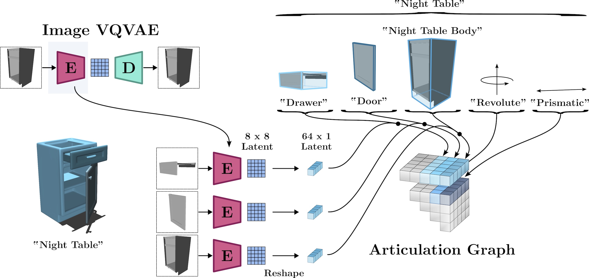
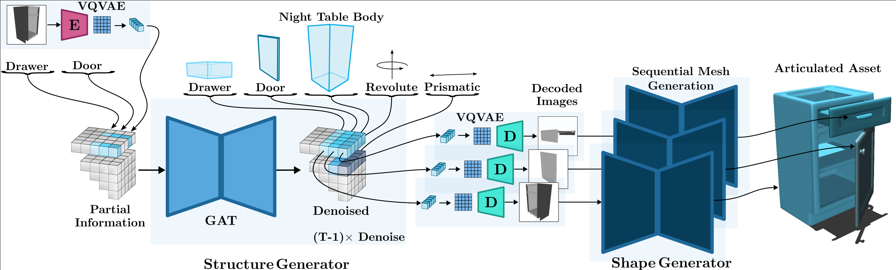
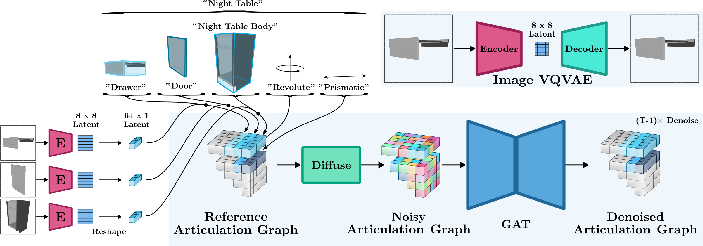
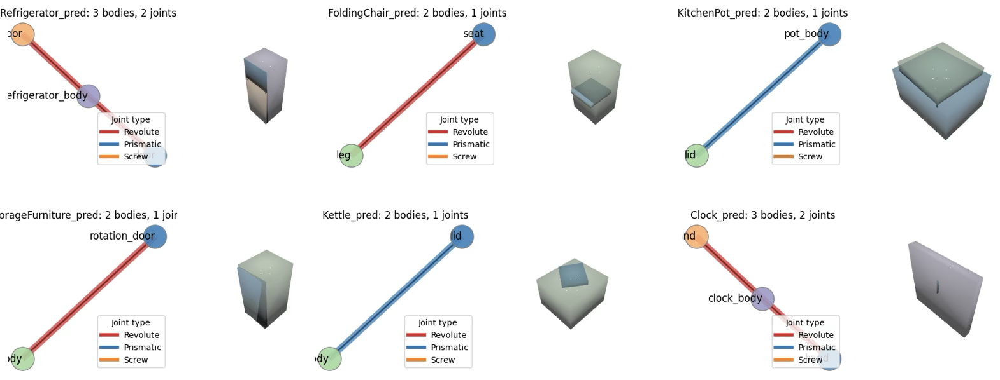
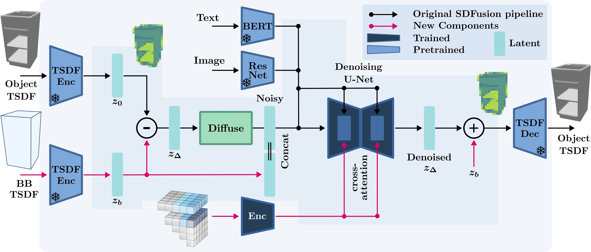
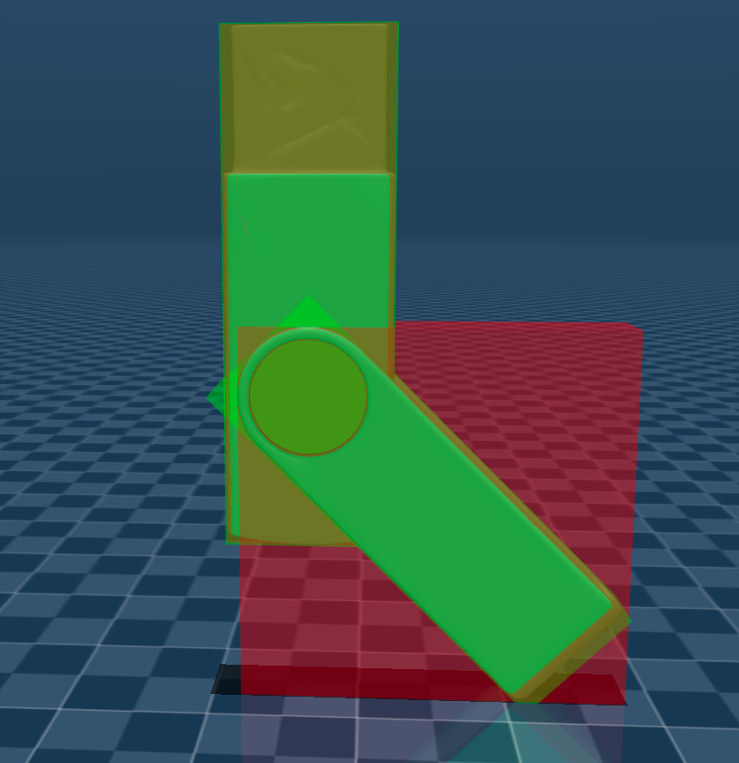
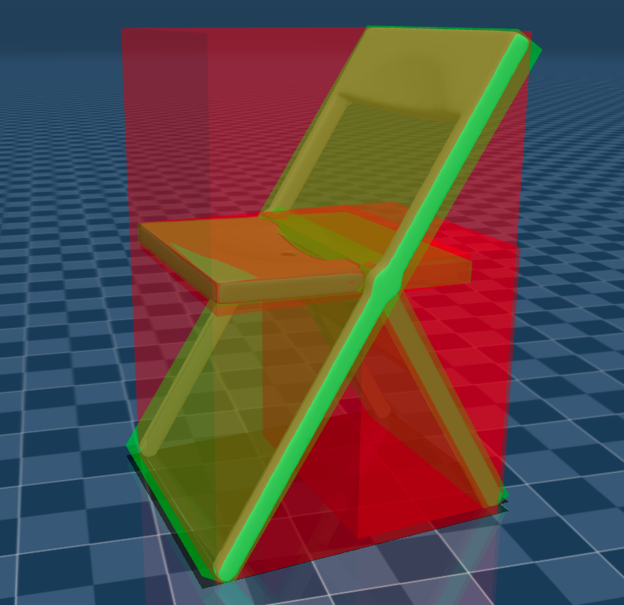
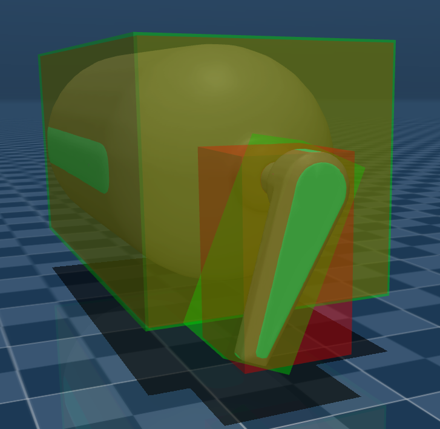
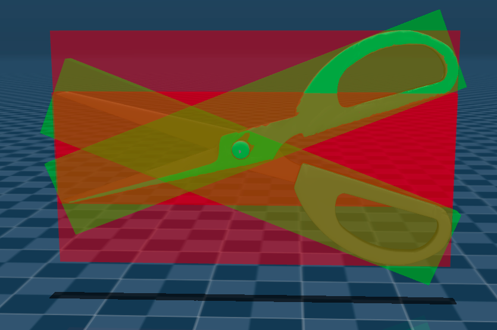

<p align="center">
<a href="https://quentin-leboutet.github.io/MIDGArD" target="_blank">
  
</a>
</p>

<div align="center">

# MIDGArD: Modular Interpretable Diffusion over Graphs for Articulated Designs

[](https://www.python.org/downloads/release/python-3128/)
<a href="https://pytorch.org/get-started/locally/"></a>
[](https://black.readthedocs.io/en/stable/)
[](https://github.com/isl-org/MIDGArD/MIDGArD/blob/main/LICENSE)
[](https://proceedings.neurips.cc/paper_files/paper/2024/file/0318de478e18308a5f64297f618299d3-Paper-Conference.pdf)

[[`Paper`](https://proceedings.neurips.cc/paper_files/paper/2024/file/0318de478e18308a5f64297f618299d3-Paper-Conference.pdf)]
[[`Project Page`](https://quentin-leboutet.github.io/MIDGArD/)]
[[`Video`](https://nips.cc/virtual/2024/poster/93424)]
</div>

**MIDGArD** - **M**odular **I**nterpretable **D**iffusion over **G**raphs for **Ar**ticulated **D**esigns - is a generative pipeline designed to synthetize consistent articulated assets that can be integrated into simulators or game engines. Its range of applications includes, but is not limited to, content creation and robotics research. 

## 1. Technical overview

<details>
  <summary> Details (Click to expand) </summary>

### 1.1. Background

Most articulated mechanisms can be represented in the form of a graph, whose node features contain the characteristics of the different links - e.g. the size or aspect ratio of every part - while the edge features relate to the characteristics of the joints connecting these links to each other. 

<p align="center">
<a href="https://github.com/isl-org/MIDGArD/MIDGArD.git" target="_blank">
  
</a>
</p>

If you define a generative process - such as a denoising diffusion process — that acts on the features of this graph representation, you can actually generate articulated assets from scratch. This idea was introduced in early 2024 by two pioneering approaches:

- [NAP: Neural 3D Articulation Prior](https://www.cis.upenn.edu/~leijh/projects/nap/)
- [CAGE: Controllable Articulation GEneration](https://3dlg-hcvc.github.io/cage)

The interesting idea behind NAP is the use of a low-dimensional latent representation for part geometries, as part of the graph node features. This latent representation is obtained for every link by pretraining an auto encoder on the different part geometries. The denoising diffusion process acts on these graph features, which means that at the end of the process, if you decode the denoised latent code of every part with the pertained decoder, you can actually generate a mesh for every link of the articulated mechanism. So in other words, you can generate a complete articulated asset. However this generation process was found to be somewhat challenging to control. This controllability issue was addressed by CAGE mainly by relying on a multilevel categorical parametrization. But at the expense however of mesh generation capability. 

<p align="center">
<a href="https://github.com/isl-org/MIDGArD/MIDGArD.git" target="_blank">
  
</a>
</p>

MIDGArD addresses the articulated asset generation problem in a modular manner, our framework separates the process into two main components, both of which are Diffusion models:

- The **Structure Generator** creates coherent articulation abstractions from incomplete or noisy articulation graphs.
- The **Shape Generator** populates the articulation abstractions with consistent meshes, conditioned on human-interpretable features (e.g. images, bounding boxes, ...) produced by the structure generator.

### 1.2. Structure Generator

The structure generator is a diffusion model which creates coherent articulation abstractions from incomplete or noisy articulation graphs. 

<p align="center">
<a href="https://github.com/isl-org/MIDGArD/MIDGArD.git" target="_blank">
  
</a>
</p>

These articulation abstraction are human interpretable and consist of a simplified geometric representation of the articulated asset along with meaningful semantic and visual information. 

<p align="center">
<a href="https://github.com/isl-org/MIDGArD/MIDGArD.git" target="_blank">
  
</a>
</p>

This interpretability allows users to intuitively understand and potentially modify the generated designs, for example the type or style of a part, its aspect ratio or the way it moves. This is made possible through the use of dedicated node level and graph level semantic labels as well as image latents in place of the 3D latents you had for example in NAP.  

### 1.3. Shape Generator

The Shape Generator populates each part of the articulated abstraction with high quality meshes. It is essentially a state-of-the-art 3D generative model conditioned on the human interpretable output of the Structure Generator (e.g. semantic information, the decoded image of each part and other relevant graph features such as bounding box informations). We decided to use [SDFusion](https://openaccess.thecvf.com/content/CVPR2023/papers/Cheng_SDFusion_Multimodal_3D_Shape_Completion_Reconstruction_and_Generation_CVPR_2023_paper.pdf) conditioned on a text prompt built from the generated semantic labels, the generated images of every link (obtained by decoding the denoised node latents) and the nodes bounding boxes. 

<p align="center">
<a href="https://github.com/isl-org/MIDGArD/MIDGArD.git" target="_blank">
  
</a>
</p>

We designed a new bounding box condition mechanism to ensure that the generated components aligned with the intended design. 

</details>

## 2. Getting Started

<details>
  <summary> Details (Click to expand) </summary>

## 2.1. Repository structure

The MIDGArD repository has the following structure:
```
MIDGArD                                   # The top-level project folder.
|                                         #
├── configs                               # Configuration files for experiments and data generation.
|                                         #
├── core                                  # Module regrouping the core functionalities of MIDGArD.
|    |                                    #
|    ├── dataset                          # Torch dataset & sampler classes.
|    |                                    #
|    ├── models                           # Relevant neural models.
|    |   |                                #
|    |   ├── structure_generator          # Structure generator modules.
|    |   ├── shape_generator              # Shape generator modules.
|    |   └── utils                        # Useful common modules.
|    |                                    # 
|    └── utils                            # Useful functions.
|                                         #
├── dataset                               # Raw and preprocessed training data.
|                                         #
├── docs                                  # Additional documentation markdown files
|                                         #
├── media                                 # Pictures and other relevant media resources of this repository.                     
|                                         #
├── output                                # Result of the training and evaluation runs.
|                                         #
├── run                                   # Collection of bash scripts calling the python routines stored in the 'scripts' folder.
|                                         #
├── scripts                               # Contains a set of training, evaluation and data generation python scripts.
|    |                                    #                                  
|    ├── dataset                          # Python scripts used to preprocess the raw PartNet-Mobility dataset.
|    ├── structure_generator              # Python scripts used to train the structure generator.  
|    └── shape_generator                  # Python scripts used to train the shape generator. 
│                                         #
├── tests                                 # Unit tests 
│                                         #
├── .github                               # Github Actions workflows
├── .gitignore                            # List of files ignored by git
├── .project-root                         # Dummy file used to locate the project root path
├── requirements.txt                      # File containing some of the main dependencies of the project
├── LICENSE                               # License file
├── pyproject.toml                        # Configuration options for testing and linting
├── README.md                             # ReadMe file
├── setup.py                              # File for installing project as a package
└── setup_midgard.sh                      # Script for setting up the MIDGArD environment
```

### 2.2. Installation & Dependencies

#### 2.2.1. Cloning the repository

To obtain the MIDGArD code, use the following command:
```bash
git clone git@github.com:isl-org/MIDGArD.git
```

#### 2.2.2. Setting up the virtual environment manager

Setting up a virtual environment manager is essential for maintaining an efficient and organized workspace. While you may already be familiar with [Anaconda](https://www.anaconda.com/download), we here provide instructions for using one of its open-source alternatives, named [Miniforge](https://github.com/conda-forge/miniforge). Miniforge is essentially a lightweight version of Anaconda that emphasizes simplicity and has a small footprint. 
To install Miniforge on your system, simply execute the following commands:
```bash
wget "https://github.com/conda-forge/miniforge/releases/latest/download/Miniforge3-$(uname)-$(uname -m).sh"
bash Miniforge3-$(uname)-$(uname -m).sh
```
This process was tested on Ubuntu 20.04, Ubuntu 22.04, Ubuntu 24.04, MacOS and Windows 11 (through WSL Ubuntu 24.04).

#### 2.2.3. Setting up the MIDGArD virtual environment

Once your virtual environment manager is installed, you may proceed and setup the `MIDGArD` workspace. We provide a bash script allowing users to automatically setup `MIDGArD` and to create a suitable virtual environment for the project, connected to a specific and well tested version of python. This is the recommended way. To run this script, open a terminal in the `MIDGArD` git repository and execute the following commands:

> **Note:** The setup script now installs PyTorch 2.10.0; PyTorch 2.8 was the version used in the project's previous validation cycle.

```bash
chmod a+x setup_midgard.sh
./setup_midgard.sh
```
The `setup_midgard` script ensures that all necessary dependencies are available on the system, automatically installing any that are missing. In case you wish to regenerate the `midgard` virtual environment, simply re-execute the `setup_midgard` script as follow:
```bash
./setup_midgard.sh true
```
We provide a basic test code to ensure that the needed dependencies are installed and correspond to the detected hardware. This code, located in `./tests/test_torch_env.py` is automatically executed at the end of the `setup_midgard` script. You can however execute it manually by calling:
```bash
conda activate midgard
pytest tests/test_torch_env.py
```
If everything works, you should now be ready to proceed with the dataset generation and the experiments. 

</details>

## 3. Dataset

<details>
  <summary> Details (Click to expand) </summary>

### 3.1. Dataset Structure

Datasets in MIDGArD should comply with the following structure:
```
MIDGArD                                     # The top-level project folder.
|                                           #
├── dataset                                 # Raw and preprocessed training data.
|    |                                      #
|    └── PartNetMobility                    # Articulation dataset.
|        |                                  #
|        ├── codebook                       # Pre-encoded image latents to be used as node features.
|        |                                  #
|        ├── data                           # Implementation of a Denoising Diffusion Model over Graph space. 
|        |    |                             #
|        |    ├── bottle                    # The different categories of articulated assets.
|        |    ├── usb                       #
|        |    ├── foldingchair              #
|        |    ├── ...                       #
|        |    └── storagefurniture          #
|        |         |                        #
|        |         ├── 35059                # The different instances of a category.
|        |         ├── 38516                #
|        |         ├── ...                  #
|        |         └── 49188                #
|        |              |                   #
|        |              ├── graph.npz       # Graph data (one graph per articulated asset).
|        |              ├── mujoco_gt.xml   # Ground truth asset representation in MuJoCo (along with AABB and OBB).
|        |              ├── images          # Image data (24 images per body / graph node).
|        |              ├── manifold_meshes # Watertight mesh data (one per body / graph node).
|        |              └── meshes          # Mesh data (one per body / graph node).
|        |                                  #
|        ├── metadata                       # Contains a bunch of relevant metadata.
|        |    |                             #
|        |    ├── info.json                 # General information about the dataset.
|        |    ├── articulated_splits.json   # Assets train/val/test splits.
|        |    ├── part_splits.json          # Parts train/val/test splits.
|        |    └── semantic_data.json         # Semantic map (i.e. label["35059"] = "bottle" / label["35059_0"] = "lid").
|        |                                  #
|        └── raw                            # Folder containing the raw data.
```

We use the [PartNet-Mobility](https://sapien.ucsd.edu/browse) dataset to train both the structure generator and the shape generator. To download the PartNet-Mobility dataset, please refer to the instructions provided in the dataset's [webpage](https://sapien.ucsd.edu/browse). Once Downloaded and decompressed, ensure that the main dataset folder containing the raw data sub-folders (named following a numerical pattern e.g. `148`, `2054`, `10638`, ...)  is renamed "`raw`" and place it in the `dataset/PartNetMobility` folder, aside the existing `codebook` and `metadata` folders. 

### 3.2. Dataset Preprocessing Pipeline

#### 3.1.1. Automated preprocessing

Each data sub-folder of the [PartNet-Mobility](https://sapien.ucsd.edu/browse) dataset consists of an of articulated asset described in the form of a [.urdf](https://wiki.ros.org/urdf/XML/model) file, linked to [.obj](https://de.wikipedia.org/wiki/Wavefront_OBJ) meshes. This raw data must be preprocessed before being usable for training and testing purposes, both in the structure generation and shape generation models. Preprocessing can be done by calling the `generate_dataset.sh` master script, assuming that the content of the `partnet-mobility-v0` raw data folder is placed in `./dataset/PartNetMobility/raw`:
```bash
./run/dataset/generate_dataset.sh
```
The preprocessed dataset will be stored in the `./dataset/data` folder. 

#### 3.1.2. Manual preprocessing

For users preferring to preprocess the dataset manually, the following section outlines the required steps:

- Generate a graph dataset. The raw meshes of the original [PartNet-Mobility](https://sapien.ucsd.edu/browse) dataset are containted in part subfolders named `textured_objs` and located in `./dataset/PartNetMobility/raw/<part_id>/textured_objs`. These meshes often turn out to be improper for direct use in the learning pipeline. As multiple meshes often refer to different subparts of a same rigid body, they must therefore be *assembled* following the recipe given in the [.urdf](https://wiki.ros.org/urdf/XML/model) file `./dataset/PartNetMobility/raw/<part_id>/mobility.urdf`. This is the objective of the python script `build_graph_dataset.py`, which can be called using the following bash command:
  ```bash
  ./run/dataset/generate_dataset.sh graph
  ```
  For every articulated asset `<asset_id>` contained in `./dataset/PartNetMobility/raw/<asset_id>` this script will:
  <ol type="a">
  <li>Parse the asset <i>.urdf</i> description file located in <code>./dataset/PartNetMobility/raw/<span>&#60;</span><mesh_id>part_id<span>&#62;</span>/mobility.urdf</code></li>
  <li>For every link of <code><span>&#60;</span>asset_id<span>&#62;</span></code>, aggregate the different meshes - <i>listed as part of the link in the .urdf file</i> - into a single mesh and save the result in a <code><span>&#60;</span><mesh_id>.obj<span>&#62;</span></code> file named <code>./dataset/PartNetMobility/data/<span>&#60;</span>part_category<span>&#62;</span>/<span>&#60;</span>part_id<span>&#62;</span>/meshes/<span>&#60;</span>mesh_id<span>&#62;</span>.obj</code> </li>
  <li>Generate a "<i>manifold</i>" version of this mesh - that can be used to build implicit representations such as TSDF - and save the result in  <code>./dataset/PartNetMobility/data/<span>&#60;</span>part_category<span>&#62;</span>/<span>&#60;</span>part_id<span>&#62;</span>/manifold_meshes/<span>&#60;</span>mesh_id<span>&#62;</span>.obj</code></li>
  <li>Estimate the mesh orientation and generate a suitable minimum-volume Oriented Bounding Box (OBB) that best encapsulates the mesh, shown in green on the figure, as a complement to the existing Axis-Alligned Bounding Box (AABB), shown in red on the figure:
  <p align="center">
  <a href="https://github.com/isl-org/MIDGArD/MIDGArD.git" target="_blank">
    
     
     
     
  </a>
  </p></li>
  <li>Extract the articulation data into a graph data structure saved in <code>./dataset/PartNetMobility/data/<span>&#60;</span>part_category<span>&#62;</span>/graph.npz</code> </li>
  </ol>

- Generate an image dataset from the different available meshes using the command:
  ```bash
  ./run/dataset/generate_dataset.sh image
  ```

</details>

## 4. Training & Evaluation

<details>
  <summary> Details (Click to expand) </summary>

### 4.1. Experiment Parameters

The configuration files governing MIDGArD's behavior are organized within the `config` folder. Before running the training or evaluation scripts, please review and adjust these files to match your requirements. Each modified configuration file must then be correctly referenced in the corresponding `run/XXX.sh` script so that the system can load the intended parameters.

### 4.2. Train & Test the Structure Generator

Before running the structure generator, you have to train the 2D embeddings generator using the following command:
```bash
./run/structure_generator/train_image_autoencoder.sh
```
Once the trained, you can generate an 2D embeddings dataset using:
```bash
./run/structure_generator/sample_image_autoencoder.sh
```
The generated dataset of image embeddings will be stored in `output/image_autoencoder/gen/latent_2d_data.npz`. In case you want to use it to train the strucutre generator, simply copy-paste this file in `dataset/PartNetMobility/codebook/latent_2d_data.npz` where it can be accessed by the DataLoader (overwrite the existing file if needed). You can then train the structure generator on the preprocessed PartNet-Mobility dataset by running the following command: 
```bash
./run/structure_generator/train.sh
```
You can visualize the state of the training process using tensorboard using the following command:
```bash
tensorboard --logdir output/<experiment_file>/logs/tensorboardX --bind_all
```

### 4.2. Train & Test the Shape Generator

Before running the shape generator, you might want to train the 3D embeddings generator. This is optional since a quite decent pretrained VQVAE model is already provided on the [SDFusion repository](https://github.com/yccyenchicheng/SDFusion?tab=readme-ov-file#download-the-pretrained-weight). You can however retrain or finetune this architecture using the following command:
```bash
./run/shape_generator/train_shape_autoencoder.sh
```
Once the 3D embeddings generator is downloaded, trained or finetuned, you can generate a 3D embeddings dataset using the following command:
```bash
./run/structure_generator/sample_shape_autoencoder.sh
```
You can then train the shape generator on the mesh embeddings of the PartNet-Mobility dataset by running the following command: 
```bash
./run/shape_generator/train.sh
```
As previously, you can visualize the state of the training process using tensorboard using the following command:
```bash
tensorboard --logdir output/<experiment_file>/logs/tensorboardX --bind_all
```

### 4.3. Evaluation process

Compute metrics and evaluate the trained diffusion model with:
```bash
./run/evaluate.sh
```
Important note: The training and evaluation processes are computationally intensive and typically take 10h+ (resp. 3h+) on a NVIDIA RTX 3090 GPU.

</details>

## 5. Acknowledgement and References

<details>
  <summary> Details (Click to expand) </summary>

### 5.1. Acknowledgement

Part of the code was inspired by the [NAP](https://github.com/JiahuiLei/NAP), [CAGE](https://github.com/3dlg-hcvc/cage) and [SDFusion](https://github.com/yccyenchicheng/SDFusion) repositories. We thank the authors of these projects for their great work.

### 5.2. Citing MIDGArD

If you use MIDGArD in your research, please consider citing our paper:
```bibtex
@inproceedings{leboutet2024midgard,
  author = {Leboutet, Quentin and Wiedemann, Nina and cai, zhipeng and Paulitsch, Michael and Yuan, Kai},
  booktitle = {Advances in Neural Information Processing Systems},
  editor = {A. Globerson and L. Mackey and D. Belgrave and A. Fan and U. Paquet and J. Tomczak and C. Zhang},
  pages = {1556--1585},
  publisher = {Curran Associates, Inc.},
  title = {MIDGArD: Modular Interpretable Diffusion over Graphs for Articulated Designs},
  url = {https://proceedings.neurips.cc/paper_files/paper/2024/file/0318de478e18308a5f64297f618299d3-Paper-Conference.pdf},
  volume = {37},
  year = {2024}
}
```
Thank you for your interest in MIDGArD. We hope this repository proves useful for your research and development needs.
Contact [Quentin Leboutet](mailto:quentin.leboutet@intel.com), [Nina Wiedemann](mailto:nina.wiedemann@intel.com) or [Kai Yuan](mailto:kai.yuan@intel.com) for questions, comments and for reporting bugs.

</details>
